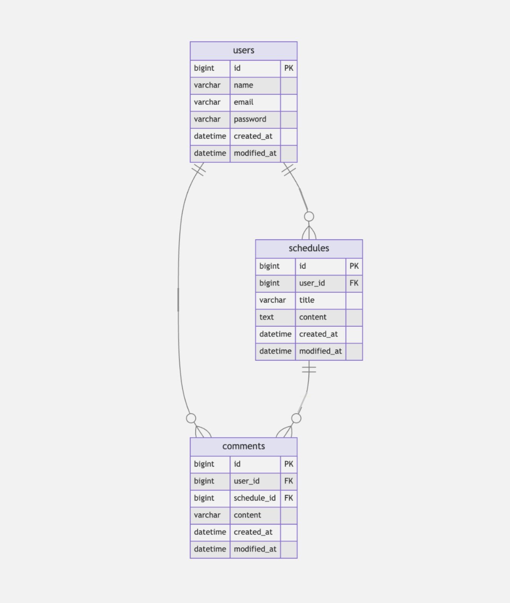

# Schedule Develop

## API

### Login

<div style="overflow-x: auto;">

| **Method** | **Endpoint** | **Description**      | **Parameters**                  | **Request Body**                                             | **Response**     | **Status Code** |
|------------|--------------|----------------------|---------------------------------|--------------------------------------------------------------|------------------|-----------------|
| `POST`     | `/users/login`     | 로그인 처리          | 없음                            | `{ "email": string, "password": string }`                    | `{ "userId": long }`  | `200 OK`        |
| `POST`     | `/users/logout`    | 로그아웃 처리        | **Session:**<br> - `LOGIN_USER` (SessionUser)                            | 없음                                                         | 없음 | `204 No Content`<br>`400 Bad Request` (세션 없음)        |

</div>

<br>

### User

<div style="overflow-x: auto;">

| **Method** | **Endpoint**    | **Description**      | **Parameters**                                | **Request Body**                                                      | **Response**                                                                                              | **Status Code** |
|------------|-----------------|----------------------|-----------------------------------------------|------------------------------------------------------------------------|-----------------------------------------------------------------------------------------------------------|-----------------|
| `POST`     | `/users/register` | 회원가입             | 없음                                          | `{ "name": string, "email": string, "password": string }`          | `{ "id": long, "name": string, "email": string, "createdAt": string, "modifiedAt": string }`             | `201 Created`        |
| `GET`      | `/users`        | 유저 목록 조회       | 없음                                          | 없음                                                                   | `[ { "id": long, "name": string, "email": string, "createdAt": string, "modifiedAt": string }, ... ]`    | `200 OK`        |
| `GET`      | `/users/{userId}`   | 단일 유저 조회       | **Path:**<br> - `userId` (Long)                    | 없음                                                                   | `{ "id": long, "name": string, "email": string, "createdAt": string, "modifiedAt": string }`             | `200 OK`        |
| `PUT`      | `/users`     | 내 정보 수정         | **Session:**<br> - `LOGIN_USER` (SessionUser)         | `{ "name": string, "password": string }`          | `{ "id": long, "name": string, "email": string, "createdAt": string, "modifiedAt": string }`             | `200 OK`        |
| `DELETE`   | `/users`     | 회원 탈퇴            | **Session:**<br> - `LOGIN_USER` (SessionUser)         | `{ "email": string, "password": string }`                                                                  | 없음                                                                                                      | `200 OK`        |

</div>

<br>

### Schedule

<div style="overflow-x: auto;">

| **Method** | **Endpoint**             | **Description**                       | **Parameters**                                                                                                                                                              | **Request Body**                                  | **Response**                                                                                                                                                             | **Status Code** |
|------------|--------------------------|---------------------------------------|-----------------------------------------------------------------------------------------------------------------------------------------------------------------------------|---------------------------------------------------|--------------------------------------------------------------------------------------------------------------------------------------------------------------------------|-----------------|
| `POST`     | `/schedules`             | 일정 생성                             | **Session:**<br> - `LOGIN_USER` (SessionUser)                                                                                                                                      | `{ "title": string, "content": string }`          | `{ "id": long, "title": string, "content": string, "createdAt": string, "modifiedAt": string }`                                                            | `201 Created`        |
| `GET`      | `/schedules`             | 일정 목록 조회 (페이징)               | **Query:**<br> - `page` (int)<br> - `size` (int)                                                                                                   | 없음                                              | `Page<[ { "id": long, "userId": long, "title": string, "content": string, "createdAt": string, "modifiedAt": string } ]>`                                                   | `200 OK`        |
| `GET`      | `/schedules/{scheduleId}`        | 단일 일정 조회                        | **Path:**<br> - `scheduleId` (Long)                                                                                                                                                  | 없음                                              | `{ "id": long, "userId": long, "title": string, "content": string, "createdAt": string, "modifiedAt": string }`                                                            | `200 OK`        |
| `PUT`      | `/schedules/{scheduleId}`        | 일정 수정                             | **Path:**<br> - `scheduleId` (Long)<br>**Session:**<br> - `LOGIN_USER` (SessionUser)                                                                                                        | `{ "title": string, "content": string }`          | `{ "id": long, "title": string, "content": string, "createdAt": string, "modifiedAt": string }`                                                            | `200 OK`        |
| `DELETE`   | `/schedules/{scheduleId}`        | 일정 삭제                             | **Path:**<br> - `scheduleId` (Long)<br>**Session:**<br> - `LOGIN_USER` (SessionUser)                                                                                                        | 없음             | 없음                                                                                                                                                                     | `200 OK`        |

</div>

<br>

### Comment

<div style="overflow-x: auto;">

| **Method** | **Endpoint**                           | **Description**                            | **Parameters**                                                                                         | **Request Body**             | **Response**                                                                                                      | **Status Code** |
|------------|----------------------------------------|--------------------------------------------|--------------------------------------------------------------------------------------------------------|------------------------------|-------------------------------------------------------------------------------------------------------------------|-----------------|
| `POST`     | `/schedules/{scheduleId}/comments`     | 댓글 생성                                   | **Path:**<br> - `scheduleId` (Long)<br>**Session:**<br> - `LOGIN_USER` (SessionUser) | `{ "content": string }`      | `{ "id": long, "content": string }`    | `201 Created`        |
| `GET`      | `/schedules/{scheduleId}/comments`     | 특정 일정에 속한 댓글 목록 조회              | **Path:**<br> - `scheduleId` (Long)<br>**Query:**<br> - `page` (int)<br> - `size` (int)                                                       | 없음                         | `Page<[ { "id": long, "content": string, "userId": long, "scheduleId": long }, ... ]>` | `200 OK`        |

</div>

<br>

## ERD



## SQL

```sql
CREATE TABLE users (
  id BIGINT AUTO_INCREMENT PRIMARY KEY,
  name VARCHAR(255) NOT NULL,
  email VARCHAR(255) NOT NULL UNIQUE,
  password VARCHAR(255) NOT NULL,
  created_at TIMESTAMP,
  modified_at TIMESTAMP
);

CREATE TABLE schedules (
  id BIGINT AUTO_INCREMENT PRIMARY KEY,
  user_id BIGINT NOT NULL,
  title VARCHAR(255) NOT NULL,
  content VARCHAR(255) NOT NULL,
  created_at TIMESTAMP,
  modified_at TIMESTAMP,
  FOREIGN KEY (user_id) REFERENCES users(id)
);

CREATE TABLE comments (
  id BIGINT AUTO_INCREMENT PRIMARY KEY,
  content VARCHAR(255) NOT NULL,
  schedule_id BIGINT NOT NULL,
  user_id BIGINT NOT NULL,
  created_at TIMESTAMP,
  modified_at TIMESTAMP,
  FOREIGN KEY (schedule_id) REFERENCES schedules(id),
  FOREIGN KEY (user_id) REFERENCES users(id)
);
```
